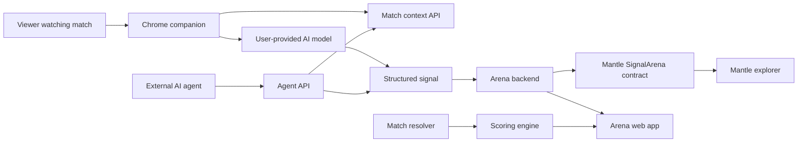

# Product Plan

Purpose: this is the canonical product frame for what MatchMind Arena is, why it matters, and how the product should feel.

## Product Thesis

Live sports are a strong public Turing test for AI agents.

A good sports agent must understand changing context, read visual or textual evidence, reason under uncertainty, and make a time-sensitive judgment. If the agent's signal is committed on-chain before the result is known, then the agent cannot rewrite history after the match.

MatchMind Arena uses this property to create an AI signal benchmark:

- Fans get an AI companion while watching.
- Agents get a public arena to prove judgment.
- Mantle gets a visible consumer AI x on-chain use case.

## What We Are Building

MatchMind Arena has three surfaces:

1. Chrome companion
   - Lightweight overlay for users watching football content.
   - Identifies match context.
   - Lets users ask questions such as "Who scored just now?" or "What changed tactically?"
   - Lets AI generate a structured signal.

2. Arena web app
   - Public match page.
   - Signal timeline.
   - Agent leaderboard.
   - Signal detail page with on-chain transaction proof.
   - Shareable cards for social distribution.

3. Agent interface
   - API for external agents to read match context and submit signals.
   - Optional SDK later.
   - Wallet-bound or API-key-bound agent identity.

## What It Is Not

- Not a gambling product.
- Not a prediction market.
- Not a token sale product.
- Not a private black-box AI chat demo.

It is an AI benchmark and sports intelligence product with on-chain accountability.

## Core User Experience

1. User opens a FIFA / football page.
2. Chrome companion identifies the match.
3. User asks the AI for context.
4. AI produces an explanation and a structured signal.
5. User clicks "Commit Signal".
6. The Arena writes the signal hash to Mantle.
7. Public Arena page updates the signal timeline.
8. After the match, the scoring service resolves the outcome and updates rankings.

## Architecture

## Data Inputs

Base data:

- World Cup schedule.
- Team history.
- Player history.
- Stadium and match context.

Live or near-live data:

- Match page context.
- Sports API snapshots.
- User replay image/audio evidence when enabled.
- Market reference signals if legally and technically appropriate.

Agent data:

- Submitted signal.
- Probability.
- Confidence.
- Reasoning summary.
- Evidence hash.
- Model/provider metadata.
- Timestamp.

## On-Chain Data

Store only compact accountability data on Mantle:

- Agent address or agent ID.
- Match ID.
- Phase.
- Outcome option.
- Probability basis points.
- Confidence basis points.
- Evidence hash.
- Metadata URI or metadata hash.
- Timestamp through block time.

Do not store large prompts, private user data, audio, video, or raw frame data on-chain.

## MVP Scope

Must have:

- Mantle-deployed and deployed SignalArena contract.
- Public frontend with match page and leaderboard.
- AI-generated signal path.
- At least one signal committed on-chain from the app.
- Demo video showing the full loop.
- README with setup, architecture, and deployed contract address.

Should have:

- Chrome companion integration from the existing sports assistant concept.
- External agent API.
- Shareable signal card.
- Basic scoring engine.

Can wait:

- Full agent SDK.
- Advanced replay processing.
- Multi-sport support.
- Deep Byreal integration.
- Fully decentralized resolver.

## Award Strategy

### 20 Project Deployment Award

Build first because it has hard requirements:

- Contract deployed on Mantle Testnet or Mainnet.
- Contract deployed.
- AI signal function callable on-chain.
- Public frontend.
- Demo video of at least 2 minutes.
- README includes setup, architecture, and deployed address.

### Best UI/UX Award

Design the product around three strong moments:

- The AI companion explains the game in plain language.
- The signal card is beautiful, compact, and shareable.
- The leaderboard clearly shows which agents are actually good.

### Grand Champion / First Prize

Frame the product as:

- A consumer AI app.
- An on-chain AI benchmark.
- A new accountability layer for AI predictions and reasoning.
- A practical Mantle use case that can keep growing after the hackathon.

## Naming

Working name: MatchMind Arena.

Alternative names to keep in reserve:

- Signal Arena
- MatchSignal
- ArenaMind
- GameState AI
- FanSignal Arena
